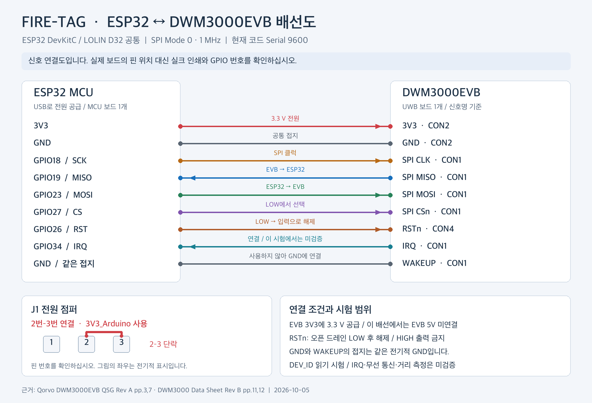

# FIRE-TAG — DWM3000EVB 연결 및 SPI 통신 시험 보고서

- 작성·시험일: 2026-10-05 (Asia/Seoul)
- 시험 환경: macOS, Arduino ESP32 core 3.3.11, esptool 5.3.1
- 제공 코드: [fire_tag_spi_test.ino](firmware/fire_tag_spi_test/fire_tag_spi_test.ino)

## 1. 시험 결과

서로 다른 ESP32 MAC 주소를 가진 연결 보드 4개를 순차 시험했습니다. 각 보드에서 DWM3000EVB 장치 ID를 10회 읽었고, **총 40회 모두 `0xDECA0302`로 확인됐습니다.** 펌웨어 업로드 시 기록 데이터의 해시 검증도 통과했습니다.

확인된 범위는 **MCU 펌웨어 기록과 UWB 모듈의 SPI 장치 ID 응답**입니다. 현재 코드에는 무선 송수신, Two-Way Ranging(TWR), 위치 계산 기능이 없습니다. IRQ 핀은 입력으로 설정하지만 인터럽트 동작은 시험하지 않습니다.

## 2. 구성

제공된 구매 목록은 DWM3000EVB 4개, ESP32 DevKitC 3개, LOLIN D32 1개를 사용해 Anchor 3개와 Tag 1개를 구성하는 계획입니다. LiPo 배터리·USB 케이블·충전기는 전원 부품입니다.

이번 시험에서는 USB로 한 보드씩 연결했습니다. 시험번호는 연결 순서이며, 펌웨어에 Anchor ID나 Tag 역할을 부여하지 않았습니다. ESP32 칩 식별 결과만으로 각 MCU 기판의 판매 모델을 확정하지 않았습니다. 배터리 충전·사용 시간은 시험 범위에 포함되지 않습니다.

## 3. 배선



[확대용 SVG 배선도](images/wiring.svg)

그림은 신호 연결을 표시합니다. 기판별 핀 위치는 실크 인쇄와 제조사 핀아웃으로 확인하십시오. 표의 `CON1`, `CON2`, `CON4`는 **DWM3000EVB의 커넥터명**입니다. 숫자 `18`, `19` 등은 **ESP32 GPIO 번호**입니다.

| ESP32 DevKitC / LOLIN D32 | DWM3000EVB | 용도 |
|---|---|---|
| 3V3 | CON2의 3V3 | EVB에 3.3 V 공급 |
| GND | CON2의 GND | 공통 접지 |
| GPIO18 | CON1의 SPI CLK | SPI 클럭 |
| GPIO19 | CON1의 SPI MISO | EVB → ESP32 데이터 |
| GPIO23 | CON1의 SPI MOSI | ESP32 → EVB 데이터 |
| GPIO27 | CON1의 SPI CSn | LOW에서 장치 선택 |
| GPIO26 | CON4의 RSTn | LOW로 리셋 후 해제 |
| GPIO34 | CON1의 IRQ | 입력 연결; 본 코드에서 기능 미검증 |
| GND | CON1의 WAKEUP | 사용하지 않는 WAKEUP을 접지 |

EVB의 **J1은 2번과 3번을 연결**해 Arduino 커넥터의 3V3 공급을 선택합니다. 이 배선에서는 EVB의 5V 핀을 연결하지 않습니다. 배선을 바꿀 때는 USB와 배터리 전원을 분리하십시오. 커넥터와 점퍼 설정은 [Qorvo Quick Start Guide, 3·7쪽](https://www.qorvo.com/products/r/ra006825)에서 확인했습니다. [동일 제조사 문서의 PDF 사본](https://www.farnell.com/datasheets/4509028.pdf)도 참조할 수 있습니다.

RSTn은 오픈 드레인 방식으로 LOW만 구동하고 입력 상태로 해제합니다. 사용하지 않는 WAKEUP은 GND에 연결할 수 있습니다. 근거는 [Qorvo DWM3000 Data Sheet, 11·12쪽](https://download.mikroe.com/documents/datasheets/DWM3000_datasheet.pdf)입니다.

## 4. 코드의 동작

1. USB 시리얼과 지정 GPIO를 초기화합니다.
2. GPIO26으로 RSTn을 2 ms 동안 LOW로 유지하고, 입력 상태로 바꿔 20 ms 기다립니다.
3. SPI Mode 0, 1 MHz, MSB first로 읽기 헤더 `0x00`을 전송합니다.
4. 받은 4바이트를 낮은 주소 바이트부터 32비트 ID로 조립합니다.
5. ID가 `0xDECA0302`와 같으면 PASS를 출력하고, 반복 끝에서 1초 기다립니다.

현재 제공 파일의 `SERIAL_BAUD`는 **9600**입니다. GPIO와 배선은 앞의 표와 동일합니다. `SPI.h`는 ESP32 Arduino 코어에 포함되므로 별도 UWB 라이브러리는 사용하지 않습니다. SPI 데이터 순서는 [DWM3000 Data Sheet, 5쪽](https://download.mikroe.com/documents/datasheets/DWM3000_datasheet.pdf)에 설명돼 있습니다.

정상 출력은 다음과 같습니다.

```text
RAW=02 03 CA DE  DEV_ID=0xDECA0302  PASS: device ID matches.
```

`0x00000000`, `0xFFFFFFFF` 또는 다른 ID가 나오면 유효한 예상 응답을 확인하지 못한 상태입니다. 전원·J1·핀 번호·SPI 배선을 순서대로 확인하십시오. 실패 ID만으로 고장 부품을 확정할 수는 없습니다.

## 5. 실제 시험 기록

| 시험번호 | ESP32 MAC 주소 | 업로드 도구의 칩 식별 | 시리얼 속도 | 정상 응답 | 원본 로그 |
|---|---|---|---:|---:|---|
| 01 | `b0:cb:d8:eb:94:ec` | ESP32-D0WD-V3 / v3.1 | 115200 | 10/10 | [PASS](logs/test_01_b0cbd8eb94ec.txt) |
| 02 | `68:09:47:9f:48:c8` | ESP32-D0WD-V3 / v3.1 | 9600 | 10/10 | [PASS](logs/test_02_6809479f48c8.txt) |
| 03 | `20:50:0d:01:0c:f8` | ESP32-D0WD-V3 / v3.1 | 9600 | 10/10 | [PASS](logs/test_03_20500d010cf8.txt) |
| 04 | `0c:b8:15:a6:25:a8` | ESP32-D0WD / v1.0 | 9600 | 10/10 | [PASS](logs/test_04_0cb815a625a8.txt) |

모든 행의 장치 ID는 `0xDECA0302`입니다. MAC 주소는 ESP32 업로드 도구의 출력으로 확인했습니다. 이 MAC은 UWB 모듈의 개별 식별번호가 아닙니다. `logs/`에는 저장된 성공 시리얼 로그를 그대로 포함했습니다.

첫 보드는 초기 코드의 115200으로 시험했습니다. 이후 출력이 깨지는 현상이 있어 코드의 시리얼 속도를 9600으로 변경했고, 나머지 세 보드는 9600에서 정상 출력을 확인했습니다. 첫 보드에는 이번 작업에서 9600 버전을 다시 기록하지 않았습니다. 제공된 최종 코드를 다시 업로드하면 해당 보드도 9600으로 출력합니다.

## 6. 업로드와 재현

Arduino IDE에서 다음 순서로 재현할 수 있습니다.

1. `firmware/fire_tag_spi_test/fire_tag_spi_test.ino`를 엽니다.
2. ESP32 Arduino 코어를 설치합니다. 본 시험의 컴파일 코어 버전은 3.3.11입니다.
3. 사용 기판에 맞는 ESP32 보드와 실제 USB 포트를 선택합니다. 본 시험 업로드에 사용한 보드 설정은 `ESP32 Dev Module` (`esp32:esp32:esp32`)입니다.
4. 업로드 후 시리얼 모니터를 **9600**으로 설정합니다.
5. RAW·DEV_ID·PASS가 반복되는지 확인합니다.

이 macOS의 기본 Arduino `ctags` 실행 파일에서는 `Bad CPU type in executable` 오류가 관찰됐습니다. 프로젝트 작업 폴더에서 ARM 네이티브 `ctags`를 준비하고, Arduino CLI의 `runtime.tools.ctags.path`를 지정해 컴파일을 완료했습니다. 일반 Arduino IDE 경로로의 재컴파일은 별도로 검증하지 않았습니다. ZIP에는 최종 코드와 함께 실제 기록에 사용한 컴파일 완료 펌웨어도 포함했습니다.

일부 업로드 시도에서 자동 부팅 진입 실패, 시리얼 출력 깨짐, 전송 오류가 관찰됐습니다. 이 원인의 하드웨어·드라이버별 분리는 완료하지 않았습니다. 후반 보드들은 **38400 업로드 속도와 ROM 부트로더 직접 전송(`--no-stub`)**으로 기록·해시 검증을 통과했습니다. 업로드 속도 38400과 실행 중 시리얼 모니터 속도 9600은 서로 다른 설정입니다.

### 컴파일 완료 펌웨어 사용

`firmware/precompiled_esp32/`는 `esp32:esp32:esp32` 설정의 최종 9600 코드입니다. 실제 기록 주소는 아래와 같습니다. 다른 ESP32 계열 칩에 대한 호환성은 시험하지 않았습니다.

| 파일 | 기록 주소 |
|---|---|
| `bootloader.bin` | `0x1000` |
| `partitions.bin` | `0x8000` |
| `boot_app0.bin` | `0xE000` |
| `fire_tag_spi_test.bin` | `0x10000` |

다음은 패키지 폴더에서 실행하는 재업로드 예시입니다. 본 시험에서 관찰한 포트는 `/dev/cu.usbserial-0001`이었으며 재연결 시 실제 포트를 확인해야 합니다. `esptool`이 설치돼 실행 가능한 환경을 전제로 합니다. 이 명령은 연결 보드의 해당 플래시 영역을 테스트 펌웨어로 덮어씁니다.

```sh
esptool --chip esp32 --port /dev/cu.usbserial-0001 --baud 38400 \
  --before default-reset --after hard-reset --no-stub write-flash -z \
  --flash-mode keep --flash-freq keep --flash-size keep \
  0x1000 firmware/precompiled_esp32/bootloader.bin \
  0x8000 firmware/precompiled_esp32/partitions.bin \
  0xe000 firmware/precompiled_esp32/boot_app0.bin \
  0x10000 firmware/precompiled_esp32/fire_tag_spi_test.bin
```

자동 부팅 진입이 실패하면 BOOT을 누른 채 EN을 한 번 눌렀다 놓고 BOOT을 해제하는 수동 진입 방법을 사용할 수 있습니다. [Espressif 수동 부트로더 안내](https://docs.espressif.com/projects/esptool/en/latest/esp32/advanced-topics/boot-mode-selection.html#manual-bootloader)를 참조하십시오.

## 7. 검증 범위와 다음 단계

| 항목 | 이번 작업에서 확인한 상태 |
|---|---|
| 테스트 코드 컴파일 | 통과 |
| 연결 보드 4개에 펌웨어 업로드·기록 해시 검증 | 통과 |
| UWB 장치 ID 읽기 | 보드당 10/10, 합계 40/40 통과 |
| IRQ 인터럽트 | 미시험 |
| UWB RF 송수신·TWR 거리 | 미시험 |
| Anchor 3개와 Tag 1개의 동시 동작·위치 계산 | 미구현·미시험 |
| 안테나 지연 보정·거리 정확도 | 미시험 |
| 배터리 충전·지속 시간 | 미시험 |

다음 개발 단계는 Anchor와 Tag 역할 지정, 두 보드 간 TWR 구현, 실제 기준 거리와의 비교, 세 Anchor 거리의 순차 수집, 좌표 계산입니다. 이번 결과로 거리 정확도나 구조 환경의 위치 추적 성능을 주장할 수는 없습니다.

## 8. 참고 자료

- [Qorvo DWM3000EVB 제품 정보](https://www.qorvo.com/products/ek/DWM3000EVB): 보드 구성과 DW3110 기반 여부.
- [Qorvo DWM3000EVB Quick Start Guide Rev A](https://www.qorvo.com/products/r/ra006825): 3쪽 커넥터 신호, 7쪽 J1 전원 선택.
- [Qorvo DWM3000 Data Sheet Rev B](https://download.mikroe.com/documents/datasheets/DWM3000_datasheet.pdf): SPI 인터페이스, WAKEUP, RSTn.
- [WEMOS LOLIN D32 문서](https://www.wemos.cc/en/latest/d32/d32.html): D32 기판 정보.
- [Espressif ESP32-DevKitC V4 안내](https://docs.espressif.com/projects/esp-dev-kits/en/latest/esp32/esp32-devkitc/user_guide.html): DevKitC 핀과 전원 정보.
- [Espressif 업로드 문제 해결](https://docs.espressif.com/projects/esptool/en/latest/esp32/troubleshooting.html): 부팅 진입과 통신 오류 진단.

## 9. ZIP 구성

```text
FIRE-TAG_SPI_Test_Package/
  FIRE-TAG_SPI_Test_Report.md             보고서 1개
  firmware/fire_tag_spi_test/
    fire_tag_spi_test.ino                 최종 테스트 코드
  firmware/precompiled_esp32/
    bootloader.bin                       컴파일 완료 부트로더
    partitions.bin                       파티션 정보
    boot_app0.bin                        Arduino 부팅 보조 이미지
    fire_tag_spi_test.bin                 최종 9600 테스트 펌웨어
  images/
    wiring.png                           Markdown에 삽입한 배선 이미지
    wiring.svg                           확대 가능한 같은 배선도
  logs/
    test_01_b0cbd8eb94ec.txt
    test_02_6809479f48c8.txt
    test_03_20500d010cf8.txt
    test_04_0cb815a625a8.txt
```

ZIP을 모두 해제한 뒤 Markdown을 열면 상대 경로로 코드·이미지·로그에 접근할 수 있습니다.
