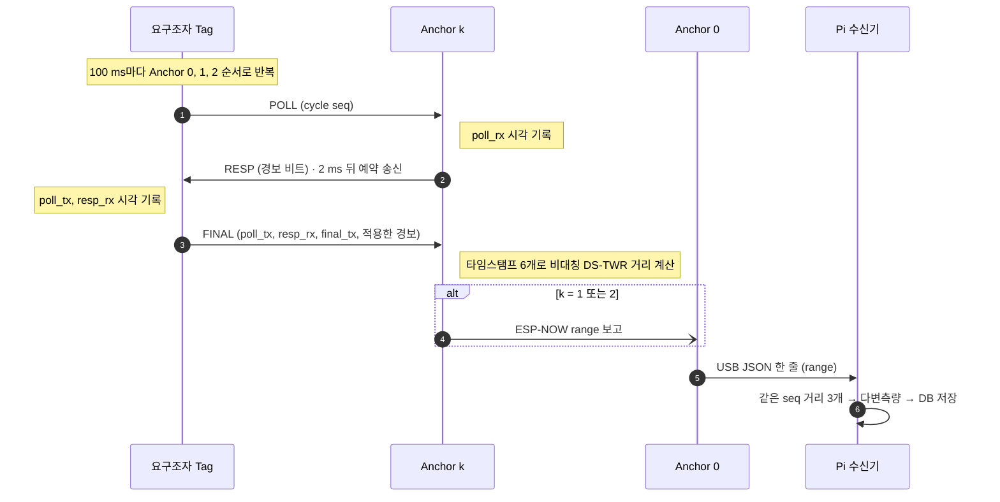
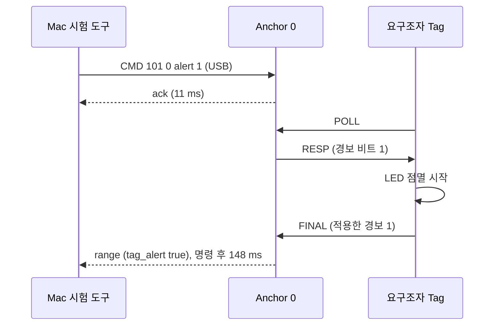

# FIRE-TAG — 요구조자 Tag ↔ Anchor UWB 연결 보고서

- 작성·시험일: 2026-10-05 (Asia/Seoul)
- 시험 환경: macOS, Arduino ESP32 core 3.3.11, esptool 5.3.1, Arduino IDE 2에 들어 있는 arduino-cli
- 앞 단계: [DWM3000EVB SPI 연결 시험 보고서](../FIRE-TAG_SPI_Test_Package/FIRE-TAG_SPI_Test_Report.md) (배선과 장치 ID 확인)

## 1. 시험 결과 요약

요구조자 Tag와 Anchor 0이 UWB로 거리를 재고, 명령을 주고받는 것을 실기로 확인했습니다.

| 확인 항목 | 방향 | 결과 |
|---|---|---|
| UWB 거리측정 | Tag ↔ Anchor 0 | 30초 동안 292회(초당 10.0회), 깨진 줄 0, 사이클 번호 누락 0 |
| Tag 쪽 성공률 | Tag 1초 요약 | 부팅 직후 1초를 빼고 매초 A0 10/10 |
| 거리값 (보정 전) | Anchor 0 계산 | 평균 234 mm, 중앙값 232 mm, 표준편차 29 mm |
| 경보 켜기 | Mac → Anchor 0 → Tag | Anchor 0 ACK 11 ms, Tag 회신 148 ms |
| 경보 끄기 | Mac → Anchor 0 → Tag | Anchor 0 ACK 11 ms, Tag 회신 148 ms |


**확인하지 않은 것**
- **위치(x, y)**: 2D 위치는 앵커 3대의 거리가 필요합니다. 이번 시험에서는 Anchor 0 한 대만 켜져 있었습니다.
- **실제 거리 대비 오차**: 두 보드 사이 거리를 줄자로 재지 않았습니다. 234 mm는 안테나 지연 보정 전 값입니다.
- **Anchor 1·2와 ESP-NOW 중계, Raspberry Pi 연동**: 이 보고서의 범위가 아닙니다.

## 2. 구성

| 역할 | 기판 | UWB | ESP32 칩 | MAC | USB 칩 · 포트 |
|---|---|---|---|---|---|
| 요구조자 Tag | LOLIN D32 | DWM3000EVB | ESP32-D0WD-V3 (v3.1) | `B0:CB:D8:EB:94:EC` | CH340 · `/dev/cu.usbserial-140` |
| Anchor 0 | ESP32 DevKitC | DWM3000EVB | ESP32-D0WD (v1.0) | `0C:B8:15:A6:25:A8` | CP2102 · `/dev/cu.usbserial-0001` |

두 보드는 SPI 시험 보고서의 test_01(Tag)과 test_04(Anchor 0) 보드입니다. 두 보드 모두 Mac에 USB로 연결했고, Mac은 USB-C 멀티미디어 허브와 USB 2.0 허브를 거칩니다.

### 배선

SPI 시험과 같습니다. 배선도는 [SPI 시험 패키지의 wiring.png](../FIRE-TAG_SPI_Test_Package/images/wiring.png)에 있습니다.

| ESP32 | DWM3000EVB | 용도 |
|---|---|---|
| 3V3 / GND | CON2 3V3 / GND | 전원 (EVB의 J1은 2-3 연결) |
| GPIO18 / 19 / 23 | CON1 SPI CLK / MISO / MOSI | SPI |
| GPIO27 | CON1 SPI CSn | 칩 선택 |
| GPIO26 | CON4 RSTn | LOW로만 구동, 해제는 입력으로 |
| GPIO34 | CON1 IRQ | 연결만 함 (펌웨어는 상태 레지스터를 폴링) |
| GND | CON1 WAKEUP | 미사용 |

요구조자 Tag의 경보 LED는 LOLIN D32 기판의 내장 LED(IO5)를 씁니다. 회로도상 3V3 → 2 kΩ → LED → IO5 구조라 IO5가 LOW일 때 켜집니다.

## 3. 통신 방식

### 무선 설정

| 항목 | 값 | 이유 |
|---|---|---|
| 채널 | 9 (7.99 GHz) | 국내 UWB 대역(기존 7.2–10.2 GHz, 신규 6.0–8.8 GHz) 모두에 포함 |
| 프리앰블 | 128 심볼, PAC 8, 코드 9 (PRF 64 MHz) | Qorvo 예제 기본값 |
| 데이터 속도 | 6.8 Mbps, STS 끔 | 프레임이 짧아 교환 시간이 짧음 |
| 안테나 지연 | 16385 (기본값) | 보정 전. 보정은 7장 참고 |
| SPI | 4 MHz | DW3000은 PLL 잠금 전 7 MHz 이하. 점퍼선이 길어 여유를 둠 |

### DS-TWR 거리측정 (Double-Sided Two-Way Ranging)

Tag가 100 ms마다 Anchor 0 → 1 → 2 순서로 아래 교환을 합니다. 거리는 FINAL을 받는 앵커가 계산합니다.



이번 시험은 Anchor 0만 켜서 1~4번(POLL, RESP, FINAL, 거리 계산)과 USB 출력까지 확인했고, Pi 대신 Mac이 USB 출력을 받았습니다.

**거리 계산식** (비대칭 DS-TWR)

```text
Ra = resp_rx − poll_tx      (Tag 시계)     Db = resp_tx − poll_rx   (앵커 시계)
Rb = final_rx − resp_tx     (앵커 시계)     Da = final_tx − resp_rx  (Tag 시계)

ToF = (Ra·Rb − Da·Db) / (Ra + Rb + Da + Db)
거리 = ToF × 15.65 ps × 299,702,547 m/s
```

이 식은 두 기기의 응답 지연이 달라도 시계 오차의 영향을 줄여 줍니다(Qorvo/Decawave APS013, 미국 특허 US20180059235A1). 타임스탬프는 32비트 차이로 계산해서 카운터가 한 바퀴 넘어가도 결과가 같습니다. 시뮬레이션에서 ±25 ppm 시계 오차와 카운터 넘김 조건으로 0.5~30 m 오차가 1 cm 미만임을 확인했습니다.

### 프레임 형식

IEEE 802.15.4 데이터 프레임(PAN ID 압축, 16비트 주소)입니다. 길이는 무선 칩이 붙이는 2바이트 FCS를 뺀 값입니다.

| 바이트 | 내용 | POLL (12 B) | RESP (13 B) | FINAL (25 B) |
|---|---|---|---|---|
| 0–1 | 프레임 제어 `0x41 0x88` | O | O | O |
| 2 | MAC 순번 | O | O | O |
| 3–4 | PAN ID `0xDECA` | O | O | O |
| 5–6 | 받는 주소 (앵커 `0x4100+id`, Tag `0x5400+id`) | 앵커 | Tag | 앵커 |
| 7–8 | 보내는 주소 | Tag | 앵커 | Tag |
| 9 | 기능 코드 | `0x21` | `0x10` | `0x23` |
| 10–11 | 사이클 번호 (Tag가 100 ms마다 1씩 증가) | O | 되돌려 보냄 | O |
| 12 | 앵커 → Tag 플래그 (bit0 = 경보) | | O | |
| 12–23 | poll_tx, resp_rx, final_tx 하위 32비트 | | | O |
| 24 | Tag가 실제 적용한 플래그 (bit0 = 경보) | | | O |

| 타이밍 (UWB 마이크로초, 1 uus = 1.0256 µs) | 값 |
|---|---|
| 수신 시각 → 예약 응답 송신 (`REPLY_DLY_UUS`) | 2000 (약 2.05 ms) |
| 송신 끝 → 수신기 켜짐 (`RX_AFTER_TX_DLY_UUS`) | 1500 |
| 수신 대기 시간 (`RX_TIMEOUT_UUS`) | 1200 |

ESP32의 Arduino SPI 처리 시간을 감안해 Qorvo 예제(700~900 uus)보다 길게 잡았습니다. Tag 요약에 `LATE`가 자주 나오면 응답 지연을 늘립니다.

### 명령과 경보 (반대 방향)



Anchor 0은 USB로 받은 `CMD <id> <대상> <이름> <값>` 줄을 실행하고 ACK를 돌려줍니다(대상 255 = 전체 앵커, 이름 = `ping` / `reboot` / `alert`). 경보 비트는 이후 모든 RESP에 실리고, Tag는 받은 상태를 FINAL에 다시 실어 보냅니다. 그래서 `tag_alert`가 바뀌는 것을 보면 명령이 Tag까지 무선으로 갔다가 돌아왔다는 것을 알 수 있습니다.

### 시리얼 출력

| 보드 | 출력 예 | 의미 |
|---|---|---|
| Tag | `# tag=0 cycle=99 alert=ON  A0 10/10  A1 0/10 (NO_RESP)  A2 0/10 (NO_RESP)` | 1초 요약: 앵커별 성공/시도와 마지막 실패 원인 |
| Anchor 0 | `{"type":"range","anchor":0,"tag":0,"seq":96,"range_mm":245,"tag_alert":true,…}` | 거리 1회 |
| Anchor 0 | `{"type":"ack","anchor":0,"id":101,"cmd":"alert","ok":true,…}` | 명령 응답 |
| Anchor 0 | `{"type":"status","anchor":0,"ok":262,"fail":0,"alert_mask":0,…}` | 1초 상태 |

`#`로 시작하는 줄은 사람이 읽는 로그입니다. 시리얼 속도는 115200 bps입니다.

## 4. 이 폴더의 파일

| 경로 | 내용 |
|---|---|
| `firmware/fire_tag_tag/` | 요구조자 Tag 펌웨어 (DS-TWR 개시자, 경보 LED) |
| `firmware/fire_tag_anchor/` | Anchor 펌웨어 (DS-TWR 응답자, ESP-NOW 중계, 명령 처리). `ANCHOR_ID`로 0/1/2 구분 |
| `firmware/libraries/FireTagUwb/` | Tag·Anchor 공통 설정 (핀, 무선 설정, 타이밍, 프레임 형식) |
| `firmware/precompiled/` | 바로 올릴 수 있는 펌웨어: `tag`, `anchor0`, `anchor1`, `anchor2` |
| `tools/capture_serial.py` | 두 시리얼을 동시에 기록하는 도구 (이번 시험 기록에 사용) |
| `logs/01_first_ranging_12s_raw.txt` | 첫 거리측정 확인 원본 (12초, 줄별 시각 없음) |
| `logs/02_alert_30s_*.log` | 경보 명령을 포함한 30초 기록 (줄마다 Mac 시각) |
| `images/tag_anchor0_30s_evidence.png` | 30초 기록을 한 장으로 정리한 캡처 |

`firmware/`의 소스는 작성 시점 저장소 최상위 `firmware/`와 같은 내용입니다(diff로 확인). 앞으로 수정은 최상위 `firmware/`에서 하고, 이 폴더는 2026-10-05 시험 당시의 기록으로 둡니다.

DW3000 드라이버는 이 폴더에 넣지 않았습니다. 저장소의 `firmware/third_party/Makerfabs-ESP32-UWB-DW3000` 서브모듈(커밋 9d449b8)을 씁니다. 원본의 라이선스 표기가 서로 달라서(library.json은 Apache-2.0, 소스 헤더는 "All rights reserved") 복사본을 공개 저장소에 두지 않았습니다.

## 5. 빌드와 업로드

### 소스에서 빌드

저장소 최상위에서:

```bash
git submodule update --init          # DW3000 드라이버
cd firmware
./build.sh tag /dev/cu.usbserial-XXXX           # 요구조자 Tag (LOLIN D32)
./build.sh anchor 0 /dev/cu.usbserial-XXXX      # Anchor 0 (ESP32 DevKitC)
SAFE_UPLOAD=1 ./build.sh tag /dev/cu.usbserial-XXXX   # 일반 업로드가 실패할 때
```

Arduino IDE를 쓰려면 이 폴더의 `firmware/libraries/FireTagUwb`와 서브모듈의 `Dw3000` 폴더를 `~/Documents/Arduino/libraries`에 복사합니다. 보드는 Tag = `LOLIN D32`, Anchor = `ESP32 Dev Module`입니다.

### 사전 빌드 펌웨어 올리기

빌드 환경 없이 올릴 때 씁니다. 네 보드 모두 주소가 같습니다.

| 파일 | 기록 주소 |
|---|---|
| `bootloader.bin` | `0x1000` |
| `partitions.bin` | `0x8000` |
| `boot_app0.bin` | `0xE000` |
| `firmware.bin` | `0x10000` |

```bash
ESPTOOL=~/Library/Arduino15/packages/esp32/tools/esptool_py/5.3.1/esptool
D=firmware/precompiled/anchor0          # tag, anchor0, anchor1, anchor2 중 선택
$ESPTOOL --chip esp32 --port /dev/cu.usbserial-XXXX --baud 38400 \
  --before default-reset --after hard-reset --no-stub write-flash -z \
  --flash-mode keep --flash-freq keep --flash-size keep \
  0x1000 $D/bootloader.bin 0x8000 $D/partitions.bin 0xe000 $D/boot_app0.bin 0x10000 $D/firmware.bin
```

38400과 `--no-stub`은 느리지만(약 3분) 이번 시험에서 일반 속도 업로드가 실패한 보드도 이 설정으로 성공했습니다. 연결이 안정적이면 `--baud 921600`으로 바꾸고 `--no-stub`을 빼도 됩니다.

| 펌웨어 | SHA-256 (`firmware.bin`) |
|---|---|
| tag | `051b758206f3fa6e4792a389a1d6fec5422b194915cd9478c60343c9641fd2b9` |
| anchor0 | `9cfc38f95a424f79aa1482837748c72f186470291736d080531556e2efabb464` |
| anchor1 | `5347c9c6427aa4b410c75aa2a5eb731fb9a84c19a30d7bb3d7622b63ab79d8ee` |
| anchor2 | `d7bd250a0a66c19e5e003403f4b822b80ee4ca9e613cb1ef5ca6eedfa3e3afb9` |

## 6. 시험 방법과 기록

### 재현 방법

1. Tag와 Anchor 0을 펌웨어로 올리고 두 보드를 USB로 연결합니다. 두 보드는 책상 위에 가깝게 둡니다.
2. Arduino 시리얼 모니터를 닫고, 이 폴더에서 아래를 실행합니다.

```bash
python3 tools/capture_serial.py --tag /dev/cu.usbserial-140 --anchor /dev/cu.usbserial-0001 \
  --seconds 30 --alert-on 10 --alert-off 20 --out logs/03_mytest
```

3. 결과 확인
   - `tag.log`에 `UWB ready`와 매초 `A0 10/10`이 나와야 합니다.
   - `anchor0.log`에 `"type":"range"` 줄이 초당 10개 나와야 합니다.
   - 10초에 `"type":"ack"`가 나오고, 그 직후부터 `"tag_alert":true`가 나와야 합니다. 이 동안 Tag 기판의 LED가 깜빡입니다.
   - 20초 뒤에는 다시 `false`가 나와야 합니다.

Arduino 시리얼 모니터(115200)만으로도 같은 내용을 볼 수 있습니다. 이 경우 Anchor 0 창에 `CMD 101 0 alert 1`을 입력하면 경보가 켜집니다.

### 기록 01: 첫 거리측정 확인 (17:44, 12초)

| 항목 | 결과 |
|---|---|
| Tag | `UWB ready`, 매초 `A0 10/10`, A1·A2는 꺼져 있어 `NO_RESP` |
| Anchor 0 거리 | 완전한 줄 115개, 사이클 누락 0, 평균 227 mm, 중앙값 236 mm, 표준편차 40 mm |

마지막 1줄은 기록 시간이 끝나며 중간에 잘린 것입니다. 처음에는 이것을 "깨진 줄"로 보고했으나 전송 오류가 아니어서 정정합니다. 02 기록부터는 도구가 잘린 마지막 줄을 데이터로 저장하지 않고 표시만 합니다.

### 기록 02: 경보 명령 포함 (17:51:00–17:51:30, 30초)

| 시각 (시작 기준) | 사건 | 근거 줄 |
|---|---|---|
| +0.554초 | Tag `UWB ready` | `02_alert_30s_tag.log` |
| +0.765초 | Anchor 0 `ESP-NOW ready: MAC 0C:B8:15:A6:25:A8` | `02_alert_30s_anchor0.log` |
| +2.366초부터 | Tag 매초 `A0 10/10` | `02_alert_30s_tag.log` |
| +10.013초 | Mac → Anchor 0 `CMD 101 0 alert 1` | `02_alert_30s_commands.log` |
| +10.024초 | Anchor 0 ACK (`id 101`, `ok true`) | `02_alert_30s_anchor0.log` |
| +10.161초 | 첫 `"tag_alert":true` (seq 96) | `02_alert_30s_anchor0.log` |
| +10.366초 | Tag 요약 `alert=ON` | `02_alert_30s_tag.log` |
| +20.014초 | Mac → Anchor 0 `CMD 102 0 alert 0` | `02_alert_30s_commands.log` |
| +20.025초 | Anchor 0 ACK (`id 102`) | `02_alert_30s_anchor0.log` |
| +20.162초 | 첫 `"tag_alert":false` (seq 196) | `02_alert_30s_anchor0.log` |

거리 줄 292개 중 깨진 줄 0, 사이클 누락 0. 경보가 켜진 10초 동안 거리 보고 100회가 모두 `tag_alert:true`였습니다.

## 7. 관찰된 문제

| 현상 | 상황 | 대응 |
|---|---|---|
| 일반 속도 업로드 실패 | Tag 첫 업로드, Anchor 0 두 번째 업로드. esptool이 플래시 확인 중 응답을 받지 못함 | `SAFE_UPLOAD=1`(38400, `--no-stub`)로 둘 다 성공 |
| 부팅 로그의 바이트 유실·조각 반복 | Anchor 0 업로드 실패 직후 리셋해서 읽을 때 (`POWERON_RESET`이 `POERON_ESET`으로 찍힘 등) | 원인 미확인. 정상 동작 중 기록(01, 02)에서는 깨진 줄 없음 |
| Mac의 USB 경로 | 보드가 USB-C 멀티미디어 허브 → USB 2.0 허브를 거쳐 연결됨 | 업로드가 계속 실패하면 Mac 포트에 직접 연결해 비교할 것 |

## 8. 다음 단계

1. **보정**: Tag와 Anchor 0 사이를 1 m, 3 m로 두고 줄자 거리와 `range_mm` 평균의 차이를 기록합니다. 이 값이 앵커별 `bias_m`입니다.
2. **Anchor 1·2**: 각 보드에 `anchor1`, `anchor2` 펌웨어를 올리고 Tag 요약이 `A1 10/10`, `A2 10/10`이 되는지 확인합니다. Anchor 0 출력에 `"via":"espnow"` 줄이 나오면 ESP-NOW 중계도 확인된 것입니다.
3. **위치**: 세 앵커를 일직선이 아닌 삼각형으로 두고 좌표를 재서 Raspberry Pi 수신기로 위치(x, y)를 확인합니다.
4. **시리얼 체크섬 검토**: 정상 동작 중 깨진 줄은 없었지만, 숫자 하나만 바뀐 줄은 JSON으로 통과해 틀린 거리가 들어갈 수 있습니다. 업로드 실패 직후 바이트 유실이 보였으므로 줄마다 CRC를 붙일지 정해야 합니다(펌웨어와 수신기 변경).

## 근거 자료

- [Qorvo DWM3000 제품·자료](https://www.qorvo.com/products/p/DWM3000)
- [DW3000 Arduino 드라이버 (Makerfabs-ESP32-UWB-DW3000, NConcepts 포팅)](https://github.com/Makerfabs/Makerfabs-ESP32-UWB-DW3000)
- [Qorvo/Decawave APS013: The implementation of two-way ranging](https://forum.qorvo.com/uploads/short-url/5yIaZ3A99NNf2uPHsUPjoBLr2Ua.pdf)
- [US20180059235A1: Asymmetric Double-Sided Two-Way Ranging](https://patents.google.com/patent/US20180059235A1/en)
- [LOLIN D32 제품 페이지 (LED_BUILTIN = GPIO5, 회로도 V1.0.0 PDF; 배터리 분압 IO35는 회로도에서 확인)](https://www.wemos.cc/en/latest/d32/d32.html)
- [DWM3000EVB SPI 연결 시험 보고서](../FIRE-TAG_SPI_Test_Package/FIRE-TAG_SPI_Test_Report.md)
