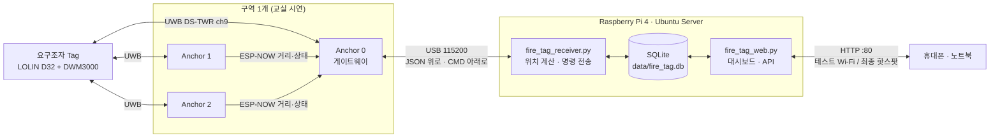

# FIRE-TAG

화재 현장에서 고립된 요구조자의 위치를 UWB로 찾는 시제품입니다. 요구조자가 지닌 Tag와 고정 앵커 3대가 거리를 재고, Raspberry Pi가 위치를 계산해 저장하고 대시보드로 보여줍니다. 대시보드에서 앵커와 Tag로 명령(점검, 재시작, 경보)을 보낼 수도 있습니다.

- 부품: DWM3000EVB ×4, ESP32 DevKitC ×3(앵커), LOLIN D32 ×1(요구조자 Tag) — [부품표](FIRE-TAG_피요구조자_발표용_최소부품.md)
- 서버: Raspberry Pi 4 + Ubuntu Server 22.04 / 24.04
- 구조, 시퀀스·상태·클래스 다이어그램, 공장 화재 현장 구성: **[docs/ARCHITECTURE.md](docs/ARCHITECTURE.md)**

```bash
git clone --recursive git@github.com:Ksyear/FIRE-TAG.git   # DW3000 드라이버가 서브모듈이라 --recursive 필요
# 이미 받았다면: git submodule update --init
```

| 상태 (2026-10-05) | 내용 |
|---|---|
| 실기 확인 | Tag ↔ Anchor 0 UWB 거리측정(10 Hz, 성공률 100%), Mac → Anchor 0 → Tag 경보 명령과 Tag 회신(148 ms). [기록](docs/evidence/2026-10-05_tag-anchor0/) |
| 시뮬레이션 확인 | 위치 계산, DB 저장, 대시보드, 명령·경보 경로 |
| 아직 안 함 | 위치(x, y) 실측(앵커 3대 필요), Anchor 1·2 ESP-NOW, Pi 연동, 핫스팟(최종 테스트 때) |

## 1. 전체 구조



**반대 방향(Pi → ESP32)**
```text
 대시보드 버튼 → DB → 수신기 ─USB "CMD ..."─▶ Anchor 0 ─ESP-NOW─▶ Anchor 1, 2
                                              │ (각 앵커가 ACK 회신 → 대시보드에 앵커별 성공·실패)
                                              └ 모든 앵커 ─UWB RESP 프레임의 경보 비트─▶ 요구조자 Tag
                                                Tag: LED(IO5) 점멸 + FINAL 프레임으로 "받았음" 회신
```
| 명령 | 동작 |
|---|---|
| `ping` (전체 점검) | 앵커 3대가 명령 경로로 응답하는지 확인. 응답 없으면 1초 간격 최대 3회 재전송 |
| `reboot` (앵커 재시작) | 해당 앵커 원격 재시작. 자동 재전송 안 함 |
| 요구조자 경보 켜기/끄기 | Pi에는 "원하는 상태"만 저장하고, 앵커 heartbeat의 상태와 다르면 Pi가 다시 맞춤 → 앵커가 재부팅돼도 자동 복구. Tag가 받았는지는 FINAL 회신으로 확인 |

- **거리는 Anchor가 계산합니다.** DS-TWR에서는 FINAL 프레임을 받는 응답자(Anchor) 쪽이 타임스탬프 6개를 모두 갖게 됩니다.
- **위치는 Pi가 계산합니다.** Anchor 하나는 자기와 Tag 사이의 거리만 알고, 2D 위치에는 거리 3개와 Anchor 좌표가 필요합니다. Anchor 좌표를 바꿀 때 펌웨어를 다시 올리지 않고 `config.json`만 고치면 됩니다.
- Anchor 1·2 → 0 구간은 **ESP-NOW**를 씁니다. 부품표상 Pi와 USB로 연결된 건 Anchor 0뿐이고 LoRa 보드도 없기 때문입니다.

## 2. 폴더

```text
firmware/
  build.sh                       컴파일·업로드 (arduino-cli)
  fire_tag_tag/                  요구조자 Tag  — LOLIN D32
  fire_tag_anchor/               Anchor 0/1/2 — ESP32 DevKitC (ANCHOR_ID로 구분)
  libraries/FireTagUwb/          Tag·Anchor 공통: 핀, UWB 설정, 프레임 형식, 타이밍
  third_party/Makerfabs-ESP32-UWB-DW3000/
                                 git 서브모듈 (커밋 9d449b8 고정). 그 안의 Dw3000/가 Qorvo DW3000 API의
                                 Arduino 포팅(NConcepts 작성). 라이선스 표기가 불분명해서 복사하지 않고 참조만 함
raspberrypi/
  fire_tag_receiver.py           수신 + 다변측량 + SQLite 저장 + 명령 전송·경보 동기화
  fire_tag_web.py                대시보드 웹 서버·명령 API (표준 라이브러리만 사용)
  web/index.html                 대시보드 (외부 CDN·폰트 없음 → 인터넷 없이 동작)
  config.json                    Anchor 좌표(m)·높이·보정값·방 크기
  setup_pi.sh                    pyserial·NetworkManager 설치 + 부팅 시 자동 실행 서비스 2개 등록
  setup_hotspot.sh               Ubuntu netplan으로 wlan0를 핫스팟으로 전환 (10.42.0.1)
  data/fire_tag.db               저장 데이터 (실행 시 생성)
```

UWB 채널, 프리앰블, 타이밍은 `FireTagUwb`에만 있습니다. Tag와 Anchor가 같은 값을 쓰도록 강제하려는 것으로, 값이 어긋나면 오류 없이 통신만 안 됩니다.

## 3. 배선 (4개 보드 모두 동일, SPI 테스트로 확인함)

| DWM3000EVB | ESP32 GPIO |
|---|---|
| SCK / MISO / MOSI | 18 / 19 / 23 |
| CS | 27 |
| RSTn | 26 (LOW만 출력, HIGH는 절대 직접 구동하지 않음) |
| IRQ | 34 (현재는 폴링 방식이라 미사용) |

## 4. 빌드·업로드 (Mac)

```bash
cd firmware
./build.sh tag    /dev/cu.usbserial-XXXX    # LOLIN D32
./build.sh anchor 0 /dev/cu.usbserial-XXXX  # Pi에 꽂을 보드
./build.sh anchor 1 /dev/cu.usbserial-XXXX
./build.sh anchor 2 /dev/cu.usbserial-XXXX
```

포트를 빼고 실행하면 컴파일만 합니다. 업로드 후에는 **각 보드에 0/1/2 라벨을 붙여 두세요.** Anchor 번호와 `config.json`의 좌표가 일치해야 합니다.

**업로드가 실패할 때** — SPI 시험(`FIRE-TAG_SPI_Test_Package` 보고서)에서 기본 속도 업로드가 실패하고 38400 + `--no-stub`으로만 기록된 보드가 있었습니다. 같은 증상이면 아래처럼 실행하세요(느리지만 확실한 방식).
```bash
SAFE_UPLOAD=1 ./build.sh anchor 2 /dev/cu.usbserial-XXXX
```
그래도 자동 진입이 안 되면 BOOT 버튼을 누른 채 EN을 한 번 눌렀다 떼고, 업로드가 시작되면 BOOT을 놓습니다.

**시리얼 속도** — 펌웨어와 Pi 모두 115200이 기본입니다(`FireTagUwb.h`의 `SERIAL_BAUD` = `config.json`의 `serial_baud`). SPI 시험에서는 115200 출력이 깨져서 9600으로 낮춘 보드가 있었습니다. 하지만 **이 통신 코드에 9600은 쓸 수 없습니다.** Anchor 0이 10 Hz 기준으로 초당 약 5 KB를 보내기 때문에 9600이면 송신 버퍼가 차서 UWB 응답 타이밍까지 망가집니다.
- 먼저 Anchor 0을 올린 뒤 시리얼 모니터 115200에서 JSON 줄이 깨지지 않는지 확인하세요. 첫 보드는 SPI 시험 때도 115200에서 정상이었으므로 케이블이나 USB 허브 문제일 가능성도 있습니다(짧은 데이터 케이블로 Mac에 직접 연결해서 비교해 보세요).
- 계속 깨지면 `SERIAL_BAUD`와 `serial_baud`를 모두 57600으로 바꾸고, Tag의 `CYCLE_MS`를 200(5 Hz)으로 늘려 데이터량을 절반으로 줄입니다.

Arduino IDE를 쓰려면 `firmware/libraries/FireTagUwb`와 `firmware/third_party/Makerfabs-ESP32-UWB-DW3000/Dw3000` 두 폴더를 `~/Documents/Arduino/libraries`에 복사하고, `fire_tag_anchor.ino` 맨 위의 `ANCHOR_ID`를 보드마다 바꿔서 업로드하면 됩니다.

## 5. Raspberry Pi 4 (Ubuntu Server) — 저장 + 핫스팟 대시보드

Ubuntu Server는 Raspberry Pi OS와 네트워크 구성이 다릅니다. 기본이 netplan + systemd-networkd인데, netplan의 Wi-Fi 핫스팟(`mode: ap`)은 **NetworkManager 렌더러에서만** 지원됩니다. 그래서 NetworkManager를 설치하고 wlan0만 NetworkManager에 맡기며, 유선(eth0) 설정은 건드리지 않습니다.

**① 폴더 복사** — `raspberrypi/` 폴더를 Pi의 공백 없는 경로로 옮깁니다(예: `scp -r raspberrypi ubuntu@<pi-ip>:~/fire-tag`).

**② 설치(인터넷 되는 상태에서 1회, 유선 LAN 권장)** — 핫스팟으로 바꾸면 wlan0으로는 인터넷이 안 되므로 패키지 설치를 먼저 합니다.
```bash
cd ~/fire-tag
chmod +x setup_pi.sh setup_hotspot.sh
./setup_pi.sh            # python3-serial, network-manager, dnsmasq-base 설치 + 서비스 2개 등록
```

**③ 핫스팟 전환** — 유선 LAN이나 키보드·모니터로 접속한 상태에서 실행합니다.
```bash
./setup_hotspot.sh 비밀번호8자이상          # SSID 기본값 "FIRE-TAG", 2.4 GHz 채널 11
```
- `/etc/netplan/90-fire-tag-ap.yaml`을 만들고 `netplan generate`로 문법을 검사한 뒤 적용합니다.
- **Raspberry Pi Imager에서 Wi-Fi를 설정해 둔 경우** cloud-init이 wlan0을 Wi-Fi 클라이언트로 이미 등록해 두었기 때문에, 스크립트가 해당 파일 이름을 알려주고 멈춥니다. 그 파일을 백업하고 `wifis:` 부분만 지운 뒤 다시 실행하세요(`ethernets:`는 그대로 둡니다).
- 되돌리기: `sudo rm /etc/netplan/90-fire-tag-ap.yaml && sudo netplan apply`

**④ 접속** — 휴대폰을 `FIRE-TAG` Wi-Fi에 연결하고 **http://10.42.0.1**을 엽니다.
- "인터넷 연결 없음" 알림이 뜨면 **"연결 유지"**를 선택합니다. 안드로이드는 모바일 데이터로 우회할 수 있으니 시연 중에는 **모바일 데이터를 꺼 두세요.**
- 핫스팟 비밀번호를 아는 사람은 누구나 경보·재시작 버튼을 누를 수 있습니다. 비밀번호는 팀원끼리만 공유하세요.

**대시보드**: 평면도(앵커, 앵커별 측정 거리 원, 최근 30초 이동 경로, 현재 위치), 요구조자 좌표·갱신 시각·**경보 켜기/끄기와 Tag 수신 확인**, 앵커 상태·**전체 점검·앵커별 재시작**과 결과(앵커별 성공·실패), 이벤트 기록. 0.5초마다 갱신됩니다.

**저장 데이터**: `data/fire_tag.db`(SQLite) — 위치(시각, 좌표, 잔차, 앵커별 거리), 앵커 상태, 이벤트, 명령 기록과 결과. "최근 1시간 CSV" 버튼으로 엑셀용 파일을 받을 수 있습니다(`/api/positions.csv?minutes=N`, 최대 1440분).

**명령 API**(버튼 대신 직접 호출할 때)
```bash
curl -X POST -H 'Content-Type: application/json' -d '{"cmd":"ping","target":"all"}' http://10.42.0.1/api/command
curl -X POST -H 'Content-Type: application/json' -d '{"cmd":"reboot","target":2}'    http://10.42.0.1/api/command
curl -X POST -H 'Content-Type: application/json' -d '{"tag":0,"on":true}'            http://10.42.0.1/api/alert
```

**운영 명령**
```bash
journalctl -u fire-tag-receiver -f        # 수신 로그 (위치 계산 결과, 보낸 CMD 줄)
sudo systemctl restart fire-tag-receiver  # config.json(앵커 좌표·bias) 수정 후 필수 — 위치 계산은 시작 시 읽은 값 사용
sudo systemctl restart fire-tag-web       # web/index.html 수정 후
sudo systemctl stop fire-tag-receiver     # 수동으로 수신기를 돌려 볼 때
python3 fire_tag_receiver.py --record raw.jsonl   # 원본 기록 → 나중에 --replay raw.jsonl 로 재계산
```

**Mac에서 미리 보기**(Pi 없이 화면 확인): `python3 fire_tag_web.py --port 8000 --db <db파일>` 실행 후 http://localhost:8000을 엽니다.

## 6. 첫 동작 확인 순서

1. **Anchor 0 + Tag만** 켭니다. Anchor 0의 시리얼 모니터에 `"type":"range","anchor":0` 줄이 나와야 합니다. Tag의 시리얼 모니터에는 1초마다 `A0 10/10  A1 0/10 (NO_RESP) ...`가 보입니다(A1·A2는 아직 꺼져 있으므로 정상).
2. 줄자로 1 m, 3 m 거리를 두고 `range_mm`의 평균 오차를 기록합니다. 이 값이 해당 Anchor의 `bias_m`입니다.
3. Anchor 1·2를 켜고 Anchor 0 출력에 `"via":"espnow"` 줄이 나오는지 확인합니다.
4. 세 Anchor를 일직선이 아닌 삼각형으로 설치하고 좌표(m)를 `config.json`에 입력합니다. Tag는 그 삼각형 안에 있을 때 가장 정확합니다.
5. Pi에서 `./setup_pi.sh` → `./setup_hotspot.sh` 순서로 실행한 뒤 휴대폰으로 http://10.42.0.1에 접속합니다.
6. 대시보드에서 **전체 점검**을 눌러 "A0 성공, A1 성공, A2 성공"이 나오는지 확인합니다(Pi→ESP32 경로 확인).
7. **경보 켜기**를 누르고 Tag LED(LOLIN D32 기판의 내장 LED, IO5)가 0.25초 간격으로 깜빡이는지, 화면에 "Tag가 경보를 받았습니다"가 뜨는지 확인합니다.

## 7. 데이터 형식

**UWB 프레임**(IEEE 802.15.4, PAN 0xDECA): `POLL`(Tag→Anchor) → `RESP`(Anchor→Tag, 약 2 ms 후) → `FINAL`(Tag→Anchor, 타임스탬프 3개 포함). 모든 프레임에 `cycle seq`가 들어가 있어 Pi가 같은 사이클의 거리를 묶을 수 있습니다. Anchor 주소는 0x4100+id, Tag 주소는 0x5400+id입니다.

RESP 프레임의 12번째 바이트(0부터 셈)는 Anchor → Tag 플래그(bit0 = 경보)이고, FINAL 프레임의 24번째 바이트는 Tag가 실제로 적용한 상태를 돌려보내는 자리입니다.

**Anchor 0 → Pi(JSON 라인)**
```json
{"type":"range","anchor":1,"tag":0,"seq":812,"range_mm":3169,"tag_alert":false,"anchor_ms":51230,"via":"espnow","link_rssi":-48}
{"type":"status","anchor":2,"ok":4120,"fail":37,"alert_mask":0,"anchor_ms":60001,"via":"espnow","link_rssi":-55}
{"type":"ack","anchor":1,"id":17,"cmd":"ping","ok":true,"anchor_ms":61002,"via":"espnow","link_rssi":-47}
```
`#`로 시작하는 줄은 사람이 읽는 로그이고, Pi는 이 줄을 무시합니다.

**Pi → Anchor 0(텍스트 라인)**: `CMD <id> <target> <name> <arg>` — target 255 = 전체, name = `ping` | `reboot` | `alert`(arg = 태그별 경보 비트마스크). Anchor 0은 자기 몫을 실행하고 나머지는 ESP-NOW로 넘깁니다. Arduino 시리얼 모니터에서 직접 `CMD 1 255 ping 0`을 입력해 시험해 볼 수도 있습니다.

## 8. 검증 범위와 남은 위험

| 항목 | 상태 | 내용 |
|---|---|---|
| 4종 펌웨어(Tag, Anchor 0/1/2) 컴파일 | 확인 | ESP32 core 3.3.11, 경고 0개 |
| Tag ↔ Anchor 0 UWB 거리측정 | 실기 확인 | 30초 동안 292회(초당 10회), 깨진 줄 0, 사이클 누락 0, 평균 234 mm·표준편차 29 mm(보정 전) |
| Mac → Anchor 0 → Tag 명령 | 실기 확인 | 경보 켜기·끄기 모두 Anchor 0 ACK, Tag 회신까지 148 ms. [기록과 캡처](docs/evidence/2026-10-05_tag-anchor0/) |
| DS-TWR 계산식 | 시뮬레이션 | ±25 ppm 클럭 오차, 카운터 넘김에서 오차 1 cm 미만 |
| Pi 다변측량·그룹핑 | 시뮬레이션 | 합성 데이터 재생: 3 cm 노이즈 → 약 3 cm 위치 오차, seq 넘김·누락 처리 |
| 저장 → 웹 대시보드 | 시뮬레이션 | DB 기록, `/api/state`, CSV 다운로드, 앵커 끊김·위치 끊김 표시, 노트북·휴대폰 화면 |
| Pi → ESP32 명령 경로 | 시뮬레이션 | 전체 점검 ACK, 경보 켜기 → Tag 수신 확인, A2 재부팅 후 경보 자동 재동기화, 경보 끄기, 잘못된 입력 거부 |
| Python 호환성 | 확인 | Python 3.9에서 실행 → Ubuntu 22.04(3.10)·24.04(3.12) 문제없음 |
| 핫스팟 netplan YAML | 확인 | 생성 결과가 의도한 구조로 파싱됨. 키 이름은 netplan 공식 문서, AP → shared(DHCP) 변환은 netplan 소스로 확인 |
| **위치(x, y) 실측** | **미확인** | 앵커 3대가 필요함. 지금은 Anchor 0 한 대만 켜져 있음 |
| **Anchor 1·2 ESP-NOW** | **미확인** | 아직 펌웨어를 올리지 않음 |
| **Pi 실기(Ubuntu 핫스팟·systemd)** | **미확인** | Pi 4에서 아직 실행하지 않음 (SSH 키 등록 대기) |

실기 시험에서 확인할 것:
- **응답 타이밍**: Tag 요약에 `LATE`가 자주 나오면 `FireTagUwb.h`의 `REPLY_DLY_UUS`(2000)를 3000으로 올립니다. 이 경우 `RX_AFTER_TX_DLY_UUS`도 같은 폭만큼 올려야 합니다.
- **SPI 안정성**: 점퍼선이 길어서 4 MHz로 설정했습니다. 초기화가 가끔 실패하면 `UWB_SPI_HZ`를 2 MHz로 낮춥니다.
- **안테나 지연**: 기본값 16385로, 보정하지 않으면 수십 cm의 고정 오차가 생길 수 있습니다. 우선 `bias_m`으로 보정합니다.
- **ESP-NOW**: 앵커 → Anchor 0 거리 보고는 브로드캐스트라 ACK와 재전송이 없습니다. `status` 줄의 `link_rssi`와 누락률을 확인하세요. Pi 명령은 ACK를 확인하고 재전송합니다.
- **시리얼 품질**: SPI 시험에서 115200 출력 깨짐과 업로드 실패가 관찰됐습니다. 2026-10-05에는 Mac → USB-C 허브 → USB 2.0 허브 경로에서 일반 속도 업로드가 실패했고, 그 직후 부팅 로그에서 바이트가 빠지거나 같은 조각이 반복되는 현상이 보였습니다. 정상 동작 중 기록(12초, 30초)에서는 깨진 줄이 없었습니다. 원인은 아직 분리되지 않았습니다. 수신기는 JSON으로 해석되지 않는 줄을 버리지만, 숫자 하나만 바뀐 줄까지는 걸러내지 못합니다. 실기에서 깨짐이 자주 보이면 줄마다 체크섬을 붙이는 방식으로 보강하는 것을 고려하세요.
- **채널 9**: 국내 UWB 대역이 자료마다 7.2–10.2 GHz(기존) 또는 6.0–8.8 GHz(신규 고시)로 다르게 나오는데, 채널 9(7.99 GHz)는 두 범위에 모두 들어갑니다. 다만 근거가 2차 자료라서 발표 전에 국립전파연구원 고시 원문을 확인하는 것이 좋습니다.
- **Anchor 0 전원**: Pi USB 포트에서 전원을 받습니다. Pi 전원이 꺼지면 위치 서비스 전체가 멈춥니다.
- **Pi 시계**: Pi 4에는 RTC가 없고, 핫스팟 모드에서는 인터넷 시간 동기화도 안 됩니다. 재부팅하면 시각이 실제와 달라질 수 있습니다. 화면의 "n초 전"과 오프라인 판정은 Pi 시계 기준으로 계산하므로 영향이 없지만, CSV의 절대 시각은 틀릴 수 있습니다(필요하면 시연 전 `sudo date -s "2026-10-05 14:00"`).
- **Pi 4 핫스팟 성능**: 내장 Wi-Fi(brcmfmac) AP는 소수 단말용입니다. 큰 파일 전송 중 끊김 사례가 보고돼 있으니 대시보드 열람 정도로만 쓰세요.
- **경보 지연**: 버튼 → Tag LED까지 보통 1초 안팎입니다(DB 반영 0.5초 + 명령 전송 + Tag 사이클 0.1초). Tag가 앵커와 통신하지 못하는 동안에는 전달되지 않고, 다시 연결되면 자동으로 전달됩니다.
- **SD 카드 용량**: 10 Hz로 계속 저장하면 하루에 대략 수십~100 MB가 쌓입니다. 시연 용도로는 문제없지만, 상시 운영하려면 오래된 데이터를 지우는 정책이 필요합니다.
- **2.4 GHz 공존**: 핫스팟은 채널 11, ESP-NOW는 채널 1로 나눠 두었습니다. 둘 중 하나를 바꾸면 다른 하나와 겹치지 않는지 확인하세요.
