# FIRE-TAG 시스템 구조

요구조자 Tag의 UWB 거리측정부터 Raspberry Pi 대시보드까지 데이터가 지나가는 길을 정리한 문서입니다. 기준일은 2026-10-05이고, 실기로 확인한 것과 시뮬레이션으로만 확인한 것을 나눠 적었습니다. 사용법은 [README](../README.md)에 있습니다.

## 1. 전체 구성

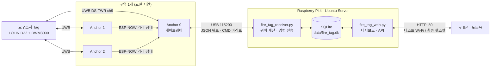

- **거리는 앵커가 계산합니다.** DS-TWR에서는 FINAL 프레임을 받는 응답자(앵커) 쪽에 타임스탬프 6개가 모두 모입니다.
- **위치는 Pi가 계산합니다.** 앵커 하나는 Tag까지의 거리만 압니다. Pi가 같은 사이클 번호의 거리 3개와 앵커 좌표(`config.json`)로 다변측량을 합니다.
- Pi와 USB로 연결된 것은 Anchor 0뿐입니다. Anchor 1·2는 ESP-NOW로 Anchor 0에 보냅니다.

## 2. 구성 단계

같은 펌웨어로 세 단계를 모두 다룹니다. 단계가 올라갈 때마다 연결 구간이 하나씩 늘어나므로, 문제가 생기면 한 단계 아래로 내려가 원인을 좁힐 수 있습니다.

| 단계 | 구성 | 확인하는 것 | 상태 |
|---|---|---|---|
| ① 단독 시험 | Tag + Anchor 0 + Mac 시리얼 모니터 | UWB 거리측정 | **실기 확인 (2026-10-05)** |
| ② 교실 시연 | Tag + 앵커 3대 + Pi + 브라우저 | 위치, 저장, 화면, 명령 | 시뮬레이션 확인, Pi 실기 연동 전 |
| ③ 실제 공장 화재 | 층·구역마다 ②를 반복 + 출입구 게이트웨이 + LTE | 건물 밖 지휘소까지 전달 | **명시만 · 미구현** |

### ① 단독 시험 (Anchor + 요구조자 Tag)

Pi와 ESP-NOW 없이 거리측정만 따로 확인합니다. 코드를 추가할 필요가 없습니다.

- Anchor 0을 Mac에 꽂고 시리얼 모니터를 115200으로 열면 `{"type":"range","anchor":0,…,"range_mm":…}` 줄이 초당 10개 나옵니다.
- Tag는 Anchor 1·2도 차례로 부르지만, 응답이 없으면 건너뜁니다(Tag의 1초 요약에 `A1 0/10 (NO_RESP)`로 표시).
- Anchor 1이나 2를 Tag와 단독으로 시험하려면, 그 보드를 잠시 Anchor 0 펌웨어로 올립니다. Anchor 1·2 펌웨어는 결과를 USB가 아니라 ESP-NOW로 내보내기 때문입니다.

### ② 교실 시연 (구역 1개)

1절의 그림이 이 구성입니다. 테스트는 지금 쓰는 Wi-Fi(Pi `192.168.68.105`)로 하고, 핫스팟(`10.42.0.1`)은 최종 테스트에서만 켭니다.

### ③ 실제 공장 화재 (명시만 · 미구현)

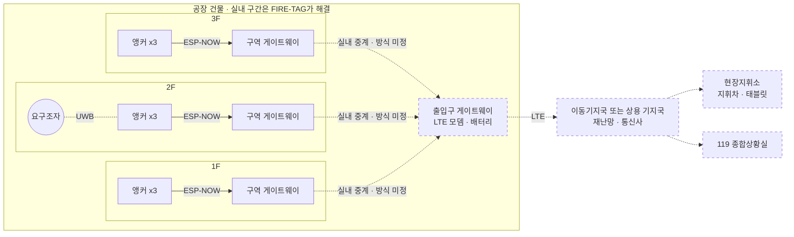

교실 시연의 구역 1개를 층과 구역마다 반복합니다. 구역 게이트웨이가 출입구 게이트웨이로 모으고, 출입구 게이트웨이가 LTE로 건물 밖에 보냅니다.

**이동기지국이 맡는 구간**
- 재난안전통신망은 음성, 사진, 영상을 전송하고, 고정 기지국이 닿지 않는 곳은 차량형·휴대형 이동기지국으로 지원합니다 ([행정안전부](https://www.mois.go.kr/frt/sub/a06/b11/policyBriefingView/screen.do)). 통신 3사도 상용망 이동기지국 차량을 현장에 보냅니다 ([정보통신신문](https://www.koit.co.kr/news/articleView.html?idxno=206430)).
- 공식적으로 확인된 투입 사례는 산불 훈련과 통신 장애 복구입니다. 공장 화재마다 투입된다는 근거는 찾지 못했습니다. 그래서 이 문서는 "투입될 수 있다"를 전제로 합니다.
- 이동기지국이 해결하는 것은 **건물 밖 게이트웨이 → 현장지휘소·119 종합상황실** 구간뿐입니다. **건물 안 → 밖** 구간은 FIRE-TAG가 직접 해결해야 합니다.
- 학생 장비를 재난망에 바로 붙일 수는 없을 것으로 봅니다(기관 단말 승인 필요, 추론). 현실적인 경로는 상용 LTE 모뎀으로 서버에 올리는 방법, 또는 소방의 119현장지원시스템과 연계하는 방법(향후 과제)입니다.

**Pi 핫스팟 하나로 건물 전체를 덮을 수 없는 이유**
- ITU-R P.1238-7 기준, 2.4 GHz 사무실 환경의 층간 손실은 14 dB입니다. 철근콘크리트 바닥은 20 dB(5.2 GHz), 덕트·조명이 있으면 30~36 dB입니다 ([ITU-R P.1238-7](https://www.itu.int/dms_pubrec/itu-r/rec/p/R-REC-P.1238-7-201202-S!!PDF-E.pdf)).
- 위치가 필요한 사람은 건물 밖 지휘소에 있습니다. Pi가 화재 구역 안에 있으면 전원과 열에도 노출됩니다. 그래서 핫스팟은 교실 시연에서 **지휘소 화면을 흉내 내는 용도**로만 씁니다.

**무선통신보조설비로 대신할 수 없는 이유**
- NFPC 505의 무선통신보조설비는 누설동축케이블 기반의 소방 무전기용 설비입니다 ([국가법령정보센터](https://www.law.go.kr/LSW/admRulLsInfoP.do?admRulSeq=2100000278542)).
- 설치 대상은 지하가, 큰 지하층, 터널, 30층 이상 건물의 16층 이상 등입니다(2차 자료 기준, 시행령 별표 4 원문 확인 필요). 일반적인 지상 공장은 대상이 아닐 가능성이 높고, 대상이더라도 데이터 백홀 용도가 아닙니다.

**왜 필요한가: 2024년 화성 아리셀 화재**
- 사망 23명, 부상 8명 ([Wikipedia](https://en.wikipedia.org/wiki/Hwaseong_battery_factory_fire), [프레시안](https://www.pressian.com/pages/articles/2024062510595697506)).
- 숨진 파견 노동자 20명은 출입문에서 23 m 떨어진 곳에 고립돼 있었습니다. 연기 발생부터 마지막 대피까지는 37초였습니다 ([경향신문](https://www.khan.co.kr/article/202408251025011)).
- 근무자 명단이 불에 타서 인원 파악이 어려웠고, 23명의 신원은 6월 27일에야 DNA로 모두 확인됐습니다 ([프레시안](https://www.pressian.com/pages/articles/2024062510595697506), [매일신문](https://www.imaeil.com/page/view/2024062718011501910)).

**아직 확인하지 못한 것**: 이동기지국이 공장 화재에 실제로 투입된 공식 사례, 시행령 별표 4 원문, 재난망에 외부 IoT 기기를 연결하는 절차. 실내 중계 방식의 참고 사례로는 NIST의 다중 홉 "breadcrumb" 중계 시제품(900 MHz·2.4 GHz)이 있습니다 ([NIST](https://www.nist.gov/ctl/real-time-deployment-mesh-networks)).

## 3. 시퀀스 다이어그램

### 거리측정 한 번 (DS-TWR)

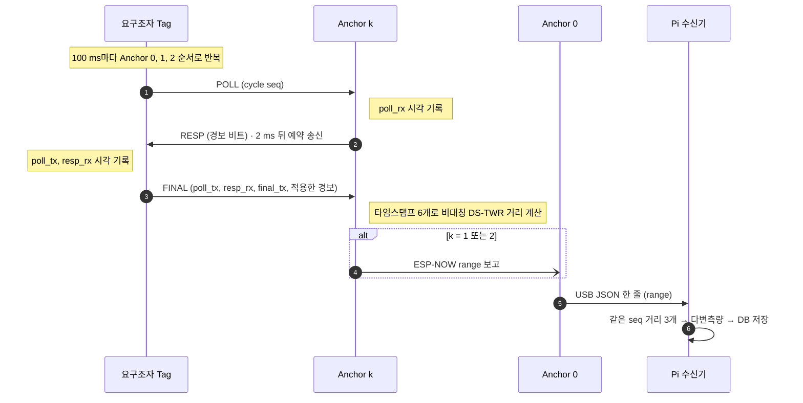

각 단계의 예약 송신 간격은 약 2 ms이고(`REPLY_DLY_UUS` = 2000), 앵커 3대를 도는 한 사이클은 약 15 ms입니다. 앵커는 32비트 타임스탬프 차이로 거리를 계산하므로 카운터가 한 바퀴 넘어가도 결과가 같습니다.

### 명령과 경보 (화면 → 앵커 → Tag)

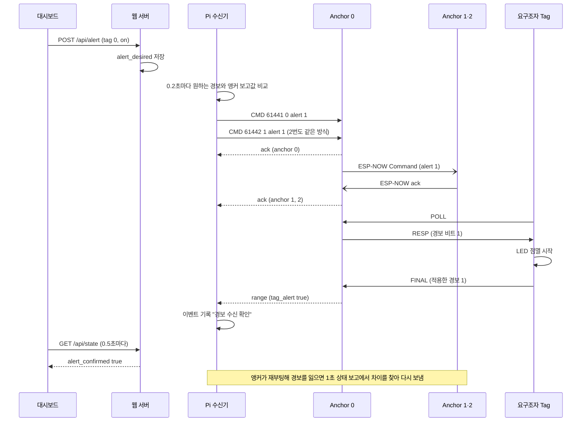

`CMD` 번호 61440(0xF000) 이상은 경보 동기화용 내부 명령이고, 그 아래는 대시보드에서 넣은 명령(DB 행 번호)입니다.

## 4. 상태 그래프

시스템이 어떤 상태에 있고 무엇이 상태를 바꾸는지 노드와 간선으로 정리했습니다. 이 시스템에는 LLM 에이전트가 없어서 LangGraph 자체는 쓰지 않습니다. 대신 같은 "노드 + 조건부 간선" 형식으로 그렸습니다.

### 화면의 요구조자 상태

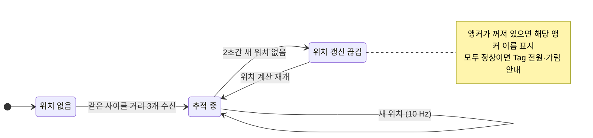

### 경보 상태

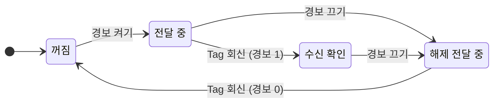

앵커가 재부팅해서 경보 상태를 잃어도 화면 상태는 바뀌지 않습니다. 다른 앵커가 계속 경보 비트를 보내고, Pi가 1초 상태 보고에서 차이를 찾아 그 앵커만 다시 맞추기 때문입니다.

### 앵커 펌웨어 (응답자)

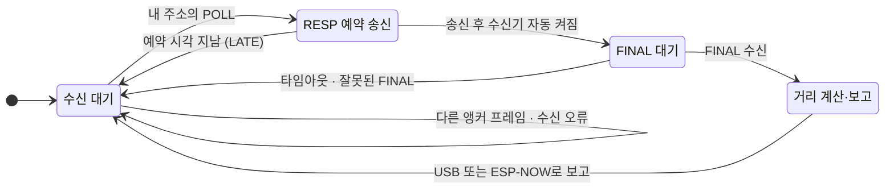

## 5. 클래스 다이어그램

### Raspberry Pi (Python)

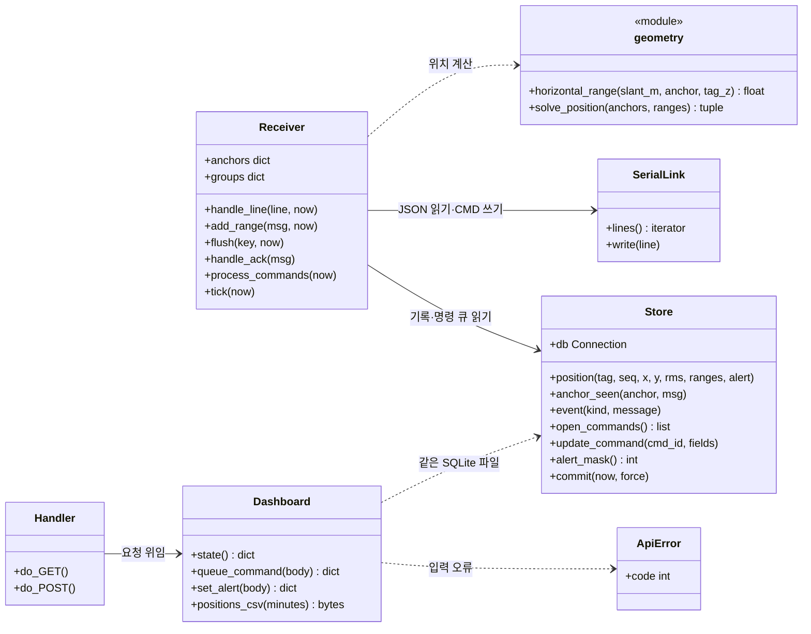

수신기와 웹 서버는 서로 다른 프로세스이고, 같은 SQLite 파일(WAL 모드)로만 연결됩니다. 웹 서버가 죽어도 저장은 계속됩니다.

### 펌웨어 (ESP32)

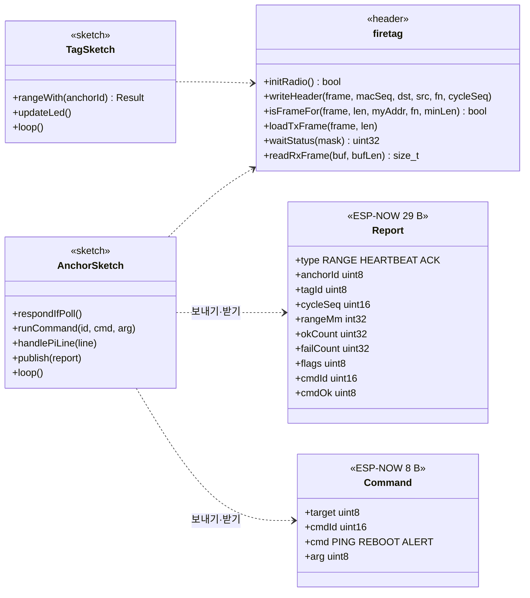

## 6. 화면 구성

| 노트북 | 휴대폰 |
|---|---|
| 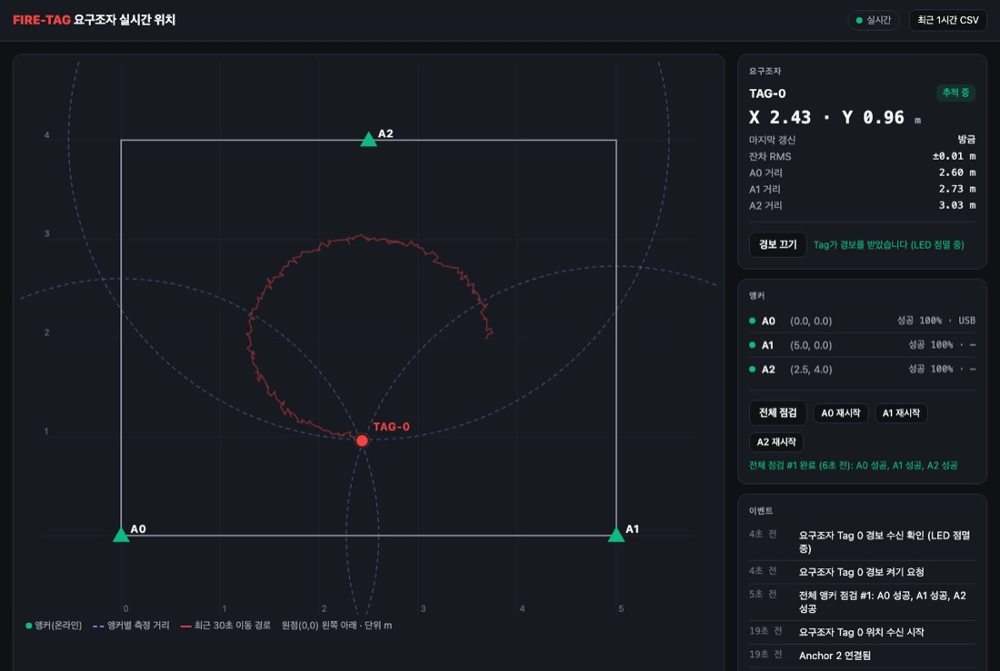 | 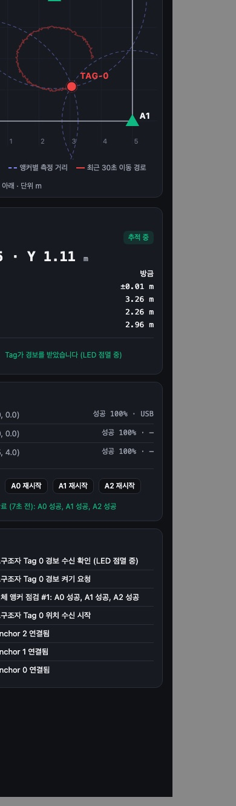 |

시뮬레이션 데이터로 찍은 화면입니다. 외부 글꼴이나 라이브러리를 쓰지 않아 인터넷 없는 핫스팟에서도 뜹니다.

| 영역 | 내용 |
|---|---|
| 상단 | Pi 연결 상태(실시간 / Pi 연결 끊김), 최근 1시간 위치 CSV 내려받기 |
| 평면도 | 앵커(초록 삼각형, 꺼지면 빈 삼각형), 앵커별 측정 거리 원, 최근 30초 이동 경로, 현재 위치. 원점은 왼쪽 아래, 단위 m |
| 요구조자 | 좌표, 마지막 갱신, 잔차 RMS, 앵커별 거리, 위치가 끊긴 원인 |
| 경보 | 켜기/끄기, Tag 수신 확인 표시 |
| 앵커 | 온라인 여부, 거리측정 성공률, ESP-NOW 신호 세기, 전체 점검, 앵커별 재시작 |
| 이벤트 | 연결·끊김, 위치 끊김·재개, 경보 요청·확인, 명령 결과 ("n초 전", Pi 시계 기준) |

## 7. 실기 확인 기록 (2026-10-05)

[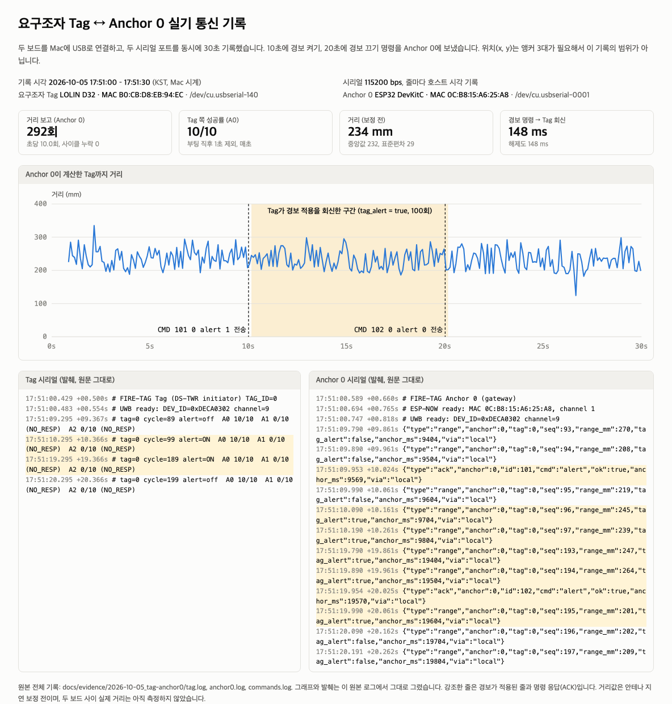](evidence/2026-10-05_tag-anchor0/)

| 항목 | 결과 |
|---|---|
| Anchor 0 (DevKitC, MAC `0C:B8:15:A6:25:A8`) | UWB 초기화(`DEV_ID 0xDECA0302`, ch9, PLL 잠금), ESP-NOW 시작 |
| 요구조자 Tag (LOLIN D32, MAC `B0:CB:D8:EB:94:EC`) | UWB 초기화, Anchor 0과 거리측정 매초 10/10. Anchor 1·2는 꺼져 있어 NO_RESP |
| Tag → Anchor 0 거리 (30초) | 292회(초당 10회), 깨진 줄 0, 사이클 누락 0, 평균 234 mm·표준편차 29 mm(보정 전) |
| Mac → Anchor 0 → Tag 경보 | 켜기·끄기 모두 Anchor 0 ACK 후 148 ms 만에 Tag 회신이 거리 보고에 실려 돌아옴 |
| Mac USB 경로 (허브 2단) | 앞선 12초 기록에서 116줄 중 1줄 깨짐. 일반 속도 업로드 실패 → 안전 모드(38400, `--no-stub`)로 성공 |
| 아직 확인하지 않은 것 | 위치(x, y): 앵커 3대 필요. 실제 거리 대비 오차: 줄자 측정 전. Anchor 1·2, Pi 연동 |

원본 로그와 기록 방법은 [docs/evidence/2026-10-05_tag-anchor0](evidence/2026-10-05_tag-anchor0/)에 있습니다.

## 8. 결정이 필요한 것

| 항목 | 이유 | 바꿀 것 |
|---|---|---|
| 시리얼 줄마다 CRC-16 | 숫자 하나가 빠진 줄도 JSON으로 통과해서 틀린 거리가 계산에 들어감. 실기에서 줄 깨짐 관찰 | 펌웨어 + 수신기 |
| 단독 시험용 거리 화면 | 지금은 시리얼 모니터의 JSON 줄로 읽음 | Mac용 작은 뷰어 (선택) |
| 층·구역 대시보드 | ③ 구성 확장 시 층 선택, 구역 게이트웨이 상태, 여러 Tag 필요 | 웹 화면 + DB |
| 실내 중계·백홀 | ③ 구성의 실내 중계(LoRa 등)와 출입구 게이트웨이 LTE 방식 미정 | 하드웨어 + 펌웨어 |
